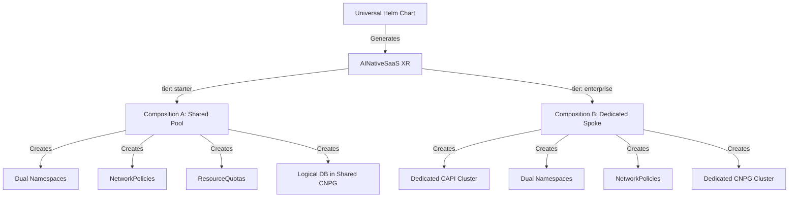
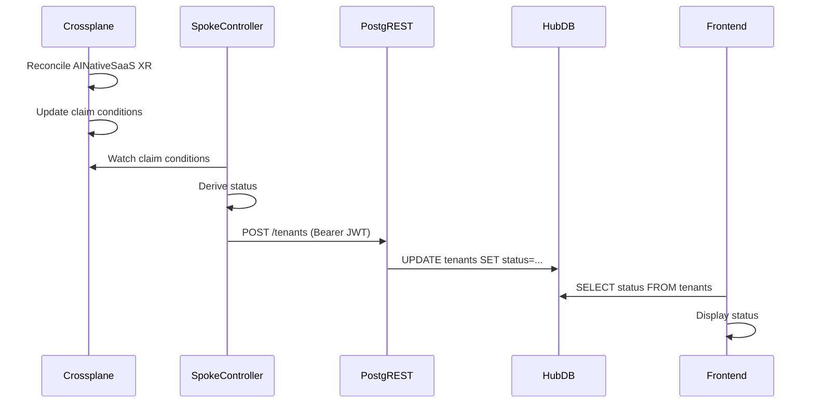

# Crossplane Compositions for Multi-Tenant SaaS

**Version:** 1.0  
**Date:** 2026-04-07  
**Purpose:** Define the `AINativeSaaS` Crossplane XRD (Composite Resource Definition) and the two Compositions (A: Shared Spoke Pool, B: Dedicated Spoke) that provision tenant infrastructure.

## Executive Summary

The Zero-Ops platform uses Crossplane as the infrastructure provisioning engine. The Universal Helm Chart generates a single `AINativeSaaS` Composite Resource (XR) per tenant, which Crossplane then reconciles using one of two Compositions based on the tenant's tier. This document specifies the XRD schema and the two Compositions in detail.

## Architecture Overview



## AINativeSaaS XRD Definition

### XRD Schema

```yaml
apiVersion: apiextensions.crossplane.io/v1
kind: CompositeResourceDefinition
metadata:
  name: ainativesaas.zero-ops.io
spec:
  group: zero-ops.io
  names:
    kind: AINativeSaaS
    plural: ainativesaas
  claimNames:
    kind: AINativeSaaSClaim
    plural: ainativesaasclaims
  versions:
  - name: v1alpha1
    served: true
    referenceable: true
    schema:
      openAPIV3Schema:
        type: object
        properties:
          spec:
            type: object
            properties:
              tenantId:
                type: string
                description: Unique tenant identifier
              tier:
                type: string
                enum: [starter, growth, premium, enterprise]
                description: Tenant tier (maps to Composition)
              tshirtSize:
                type: string
                enum: [basic, standard, premium, enterprise]
                description: Resource allocation size
              region:
                type: string
                description: Geographic region (e.g., eu-central-1)
              features:
                type: array
                items:
                  type: string
                description: Enabled features (e.g., ai-runtime, vector-search)
              controlPlaneRepo:
                type: object
                properties:
                  url:
                    type: string
                  path:
                    type: string
                  targetRevision:
                    type: string
              appPlaneRepo:
                type: object
                properties:
                  url:
                    type: string
                  path:
                    type: string
                  targetRevision:
                    type: string
            required:
            - tenantId
            - tier
            - tshirtSize
            - region
          status:
            type: object
            properties:
              phase:
                type: string
                description: Current provisioning phase
              conditions:
                type: array
                items:
                  type: object
              controlPlaneNamespace:
                type: string
              appPlaneNamespace:
                type: string
              databaseEndpoint:
                type: string
              clusterEndpoint:
                type: string
```

### Example XR Instance

```yaml
apiVersion: zero-ops.io/v1alpha1
kind: AINativeSaaS
metadata:
  name: tenant-acme-123
  namespace: default
spec:
  tenantId: "acme-123"
  tier: starter
  tshirtSize: basic
  region: eu-central-1
  features:
    - ai-runtime
    - vector-search
  controlPlaneRepo:
    url: https://github.com/acme-123/control-plane
    path: manifests
    targetRevision: main
  appPlaneRepo:
    url: https://github.com/acme-123/app-plane
    path: manifests
    targetRevision: main
```

## Composition A: Shared Spoke Pool (Starter/Growth Tiers)

### Purpose
Provisions tenant infrastructure in a shared Spoke Pool cluster. Supports up to 100 tenants (200 namespaces) per Spoke Pool with strict network isolation.

### Composition Selector

```yaml
apiVersion: apiextensions.crossplane.io/v1
kind: Composition
metadata:
  name: ainativesaas-shared-pool
  labels:
    crossplane.io/xrd: ainativesaas.zero-ops.io
    tier: starter
spec:
  compositeTypeRef:
    apiVersion: zero-ops.io/v1alpha1
    kind: AINativeSaaS
  mode: Pipeline
  pipeline:
  - step: create-control-plane-namespace
    functionRef:
      name: function-patch-and-transform
    input:
      apiVersion: pt.fn.crossplane.io/v1beta1
      kind: Resources
      resources:
      - name: control-plane-namespace
        base:
          apiVersion: v1
          kind: Namespace
          metadata:
            name: # patched from spec.tenantId
            labels:
              zero-ops.io/tenant-id: # patched
              zero-ops.io/plane: control
        patches:
        - type: FromCompositeFieldPath
          fromFieldPath: spec.tenantId
          toFieldPath: metadata.name
          transforms:
          - type: string
            string:
              fmt: "tenant-%s-cp"
        - type: FromCompositeFieldPath
          fromFieldPath: spec.tenantId
          toFieldPath: metadata.labels[zero-ops.io/tenant-id]
  
  - step: create-app-plane-namespace
    functionRef:
      name: function-patch-and-transform
    input:
      apiVersion: pt.fn.crossplane.io/v1beta1
      kind: Resources
      resources:
      - name: app-plane-namespace
        base:
          apiVersion: v1
          kind: Namespace
          metadata:
            name: # patched from spec.tenantId
            labels:
              zero-ops.io/tenant-id: # patched
              zero-ops.io/plane: application
        patches:
        - type: FromCompositeFieldPath
          fromFieldPath: spec.tenantId
          toFieldPath: metadata.name
          transforms:
          - type: string
            string:
              fmt: "tenant-%s-app"
        - type: FromCompositeFieldPath
          fromFieldPath: spec.tenantId
          toFieldPath: metadata.labels[zero-ops.io/tenant-id]
  
  - step: create-network-policy
    functionRef:
      name: function-patch-and-transform
    input:
      apiVersion: pt.fn.crossplane.io/v1beta1
      kind: Resources
      resources:
      - name: dual-plane-network-policy
        base:
          apiVersion: networking.k8s.io/v1
          kind: NetworkPolicy
          metadata:
            name: tenant-isolation
            namespace: # patched to tenant-{id}-app
          spec:
            podSelector: {}
            policyTypes:
            - Ingress
            - Egress
            ingress:
            # Allow traffic from tenant's own Control Plane
            - from:
              - namespaceSelector:
                  matchLabels:
                    zero-ops.io/tenant-id: # patched
                    zero-ops.io/plane: control
            # Allow traffic from Ingress controller
            - from:
              - namespaceSelector:
                  matchLabels:
                    kubernetes.io/metadata.name: ingress-nginx
            egress:
            # Allow traffic to shared CNPG database
            - to:
              - namespaceSelector:
                  matchLabels:
                    kubernetes.io/metadata.name: hub-platform-data
              ports:
              - protocol: TCP
                port: 5432
            # Allow DNS
            - ports:
              - protocol: UDP
                port: 53
        patches:
        - type: FromCompositeFieldPath
          fromFieldPath: spec.tenantId
          toFieldPath: metadata.namespace
          transforms:
          - type: string
            string:
              fmt: "tenant-%s-app"
        - type: FromCompositeFieldPath
          fromFieldPath: spec.tenantId
          toFieldPath: spec.ingress[0].from[0].namespaceSelector.matchLabels[zero-ops.io/tenant-id]
  
  - step: create-resource-quota-cp
    functionRef:
      name: function-patch-and-transform
    input:
      apiVersion: pt.fn.crossplane.io/v1beta1
      kind: Resources
      resources:
      - name: control-plane-quota
        base:
          apiVersion: v1
          kind: ResourceQuota
          metadata:
            name: tenant-quota
            namespace: # patched to tenant-{id}-cp
          spec:
            hard:
              requests.cpu: # patched based on tshirtSize
              requests.memory: # patched based on tshirtSize
              limits.cpu: # patched based on tshirtSize
              limits.memory: # patched based on tshirtSize
        patches:
        - type: FromCompositeFieldPath
          fromFieldPath: spec.tenantId
          toFieldPath: metadata.namespace
          transforms:
          - type: string
            string:
              fmt: "tenant-%s-cp"
        - type: CombineFromComposite
          combine:
            variables:
            - fromFieldPath: spec.tshirtSize
            strategy: string
            string:
              fmt: "%s"
          toFieldPath: spec.hard[requests.cpu]
          transforms:
          - type: map
            map:
              basic: "1"
              standard: "2"
              premium: "4"
              enterprise: "8"
        - type: CombineFromComposite
          combine:
            variables:
            - fromFieldPath: spec.tshirtSize
            strategy: string
            string:
              fmt: "%s"
          toFieldPath: spec.hard[requests.memory]
          transforms:
          - type: map
            map:
              basic: "2Gi"
              standard: "4Gi"
              premium: "8Gi"
              enterprise: "16Gi"
  
  - step: create-resource-quota-app
    functionRef:
      name: function-patch-and-transform
    input:
      apiVersion: pt.fn.crossplane.io/v1beta1
      kind: Resources
      resources:
      - name: app-plane-quota
        base:
          apiVersion: v1
          kind: ResourceQuota
          metadata:
            name: tenant-quota
            namespace: # patched to tenant-{id}-app
          spec:
            hard:
              requests.cpu: # patched based on tshirtSize
              requests.memory: # patched based on tshirtSize
              limits.cpu: # patched based on tshirtSize
              limits.memory: # patched based on tshirtSize
        patches:
        - type: FromCompositeFieldPath
          fromFieldPath: spec.tenantId
          toFieldPath: metadata.namespace
          transforms:
          - type: string
            string:
              fmt: "tenant-%s-app"
        # Same quota mapping as control plane
  
  - step: create-logical-database
    functionRef:
      name: function-patch-and-transform
    input:
      apiVersion: pt.fn.crossplane.io/v1beta1
      kind: Resources
      resources:
      - name: tenant-database
        base:
          apiVersion: postgresql.cnpg.io/v1
          kind: Database
          metadata:
            name: # patched from spec.tenantId
            namespace: hub-platform-data
          spec:
            cluster:
              name: shared-cnpg-cluster
            owner: # patched from spec.tenantId
        patches:
        - type: FromCompositeFieldPath
          fromFieldPath: spec.tenantId
          toFieldPath: metadata.name
          transforms:
          - type: string
            string:
              fmt: "tenant_%s"
        - type: FromCompositeFieldPath
          fromFieldPath: spec.tenantId
          toFieldPath: spec.owner
          transforms:
          - type: string
            string:
              fmt: "tenant_%s_role"
```

### Key Features of Composition A

1. **Dual Namespaces:** Creates `tenant-{id}-cp` and `tenant-{id}-app` with proper labels
2. **Network Isolation:** NetworkPolicy strictly binds Application Plane to its own Control Plane
3. **Resource Quotas:** T-shirt size-based quotas for both namespaces
4. **Logical Database:** Provisions a logical database and role in the shared CNPG cluster
5. **PostgreSQL RLS:** Database-level tenant isolation via Row-Level Security

## Composition B: Dedicated Spoke (Premium/Enterprise Tiers)

### Purpose
Provisions a dedicated Hetzner CAPI cluster for a single tenant with dedicated CNPG database.

### Composition Overview

```yaml
apiVersion: apiextensions.crossplane.io/v1
kind: Composition
metadata:
  name: ainativesaas-dedicated-spoke
  labels:
    crossplane.io/xrd: ainativesaas.zero-ops.io
    tier: enterprise
spec:
  compositeTypeRef:
    apiVersion: zero-ops.io/v1alpha1
    kind: AINativeSaaS
  mode: Pipeline
  pipeline:
  - step: create-capi-cluster
    functionRef:
      name: function-patch-and-transform
    input:
      apiVersion: pt.fn.crossplane.io/v1beta1
      kind: Resources
      resources:
      - name: dedicated-cluster
        base:
          apiVersion: cluster.x-k8s.io/v1beta1
          kind: Cluster
          metadata:
            name: # patched from spec.tenantId
            namespace: default
          spec:
            clusterNetwork:
              pods:
                cidrBlocks:
                - 10.244.0.0/16
              services:
                cidrBlocks:
                - 10.96.0.0/12
            topology:
              class: hetzner-prod-ubuntu-v1
              version: v1.31.6
              workers:
                machineDeployments:
                - class: default-worker
                  name: md-0
                  replicas: 3
        patches:
        - type: FromCompositeFieldPath
          fromFieldPath: spec.tenantId
          toFieldPath: metadata.name
          transforms:
          - type: string
            string:
              fmt: "spoke-%s"
  
  - step: create-cnpg-cluster
    functionRef:
      name: function-patch-and-transform
    input:
      apiVersion: pt.fn.crossplane.io/v1beta1
      kind: Resources
      resources:
      - name: dedicated-database
        base:
          apiVersion: postgresql.cnpg.io/v1
          kind: Cluster
          metadata:
            name: # patched from spec.tenantId
            namespace: # patched to tenant-{id}-cp
          spec:
            instances: 3
            storage:
              size: 100Gi
            postgresql:
              parameters:
                max_connections: "200"
        patches:
        - type: FromCompositeFieldPath
          fromFieldPath: spec.tenantId
          toFieldPath: metadata.name
          transforms:
          - type: string
            string:
              fmt: "tenant-%s-db"
        - type: FromCompositeFieldPath
          fromFieldPath: spec.tenantId
          toFieldPath: metadata.namespace
          transforms:
          - type: string
            string:
              fmt: "tenant-%s-cp"
  
  # Dual namespaces and NetworkPolicies (same as Composition A)
  # ... (omitted for brevity, same structure as Composition A)
```

### Key Features of Composition B

1. **Dedicated CAPI Cluster:** Full Hetzner cluster via Cluster API
2. **Dedicated CNPG Database:** 3-instance PostgreSQL cluster (no RLS needed)
3. **Dual Namespaces:** Same dual-namespace pattern as Composition A
4. **Network Policies:** Same dual-plane isolation policy
5. **SPIRE Agent:** Injected via CAPI ClusterResourceSet for Hub authentication

## Bootstrap Handoff & Edge Catalog Deployment

### The Agent-Only Bootstrap Pattern

**Critical Design Principle:** ClusterResourceSet is used ONLY for injecting the ArgoCD Agent (Secret Zero). All platform components are deployed via ArgoCD ApplicationSets.

**Timeline:**
1. **Infrastructure:** Crossplane + CAPI provision Hetzner VMs
2. **Bootstrap:** CAPI ClusterResourceSet injects ArgoCD Agent manifests and connection token
3. **Agent Connection:** ArgoCD Agent boots and connects to Hub ArgoCD
4. **Platform Deployment:** ArgoCD Cluster Generator ApplicationSet deploys edge-catalog
5. **Tenant Deployment:** ArgoCD Git Generator ApplicationSet deploys tenant workloads

### Fleet Infrastructure ApplicationSet

Once the ArgoCD Agent connects to the Hub, this ApplicationSet automatically deploys the edge-catalog to all Spoke Pool clusters:

```yaml
apiVersion: argoproj.io/v1alpha1
kind: ApplicationSet
metadata:
  name: spoke-pool-infrastructure
  namespace: argocd
spec:
  generators:
  - clusters:
      selector:
        matchLabels:
          spoke-type: pool  # Targets all Spoke Pool clusters
  template:
    metadata:
      name: '{{name}}-edge-catalog'
    spec:
      project: platform
      source:
        repoURL: https://github.com/zero-ops/catalog
        targetRevision: HEAD
        path: edge-catalog/  # Contains CNPG, NATS, SPIRE, Alloy
      destination:
        server: '{{server}}'
      syncPolicy:
        automated:
          prune: true
          selfHeal: true
```

**Edge Catalog Contents:**
- CNPG Operator & Shared Cluster (PostgreSQL for tenant databases)
- NATS Leaf Node (event bus connection to Hub)
- SPIRE Agent (identity federation with Hub)
- Grafana Alloy (metrics forwarding to Hub VictoriaMetrics)
- Kubeconfig Sidecar (generates kubeconfigs for Headlamp multi-cluster monitoring)

**Why This Pattern?**
- Drift reconciliation via ArgoCD (CRS is fire-and-forget)
- Visual observability in ArgoCD UI
- Easy upgrades via Git commit (no CAPI template changes)
- Self-healing if components are accidentally deleted

## SpokePool XR for Cell-Based Scaling

### Purpose
Platform Admins create `SpokePool` XRs to provision new Spoke Pool clusters for hosting multiple tenants.

### SpokePool XRD

```yaml
apiVersion: apiextensions.crossplane.io/v1
kind: CompositeResourceDefinition
metadata:
  name: spokepools.zero-ops.io
spec:
  group: zero-ops.io
  names:
    kind: SpokePool
    plural: spokepools
  versions:
  - name: v1alpha1
    served: true
    referenceable: true
    schema:
      openAPIV3Schema:
        type: object
        properties:
          spec:
            type: object
            properties:
              region:
                type: string
                description: Geographic region
              capacity:
                type: integer
                description: Maximum number of tenants
              tier:
                type: string
                enum: [starter, growth]
                description: Which tier this pool hosts
              clusterClass:
                type: string
                description: CAPI ClusterClass template
              nodeCount:
                type: integer
                description: Number of worker nodes
            required:
            - region
            - capacity
            - tier
            - clusterClass
```

### Example SpokePool Instance

```yaml
apiVersion: zero-ops.io/v1alpha1
kind: SpokePool
metadata:
  name: spoke-pool-eu-central-1
spec:
  region: eu-central-1
  capacity: 100
  tier: starter
  clusterClass: hetzner-prod-ubuntu-v1
  nodeCount: 5
```

### SpokePool Composition

The SpokePool Composition provisions:
1. **CAPI Cluster:** Hetzner cluster with specified node count
2. **ClusterResourceSet:** Injects ONLY the ArgoCD Agent (Secret Zero) to enable GitOps
3. **Fleet Registry Entry:** Registers the pool with Hub ArgoCD

Once the ArgoCD Agent connects to the Hub, an ArgoCD ApplicationSet (Cluster Generator) deploys the edge-catalog (CNPG, NATS, SPIRE, Alloy) to the Spoke.

## Capacity Management

### Fleet Registry Structure

```yaml
apiVersion: fleet.zero-ops.io/v1alpha1
kind: SpokePoolRegistry
metadata:
  name: spoke-pool-registry
spec:
  pools:
  - name: spoke-pool-eu-central-1
    region: eu-central-1
    capacity: 100
    utilization: 73
    available: 27
    tier: starter
    status: Ready
  - name: spoke-pool-us-east-1
    region: us-east-1
    capacity: 100
    utilization: 45
    available: 55
    tier: starter
    status: Ready
```

### Tenant Assignment Logic

When a new tenant is created:
1. Tenant API queries Fleet Registry for available pools matching tenant's region and tier
2. Selects pool with lowest utilization and available capacity > 0
3. Assigns tenant to selected pool
4. Updates Fleet Registry utilization counter
5. If no pools have capacity, alerts Platform Admin to provision new SpokePool XR

## Status Reporting

### Headlamp Multi-Cluster Monitoring Pattern

Headlamp provides centralized monitoring across all Spoke clusters via:
1. Watches Crossplane `AINativeSaaS` claim conditions
2. Derives tenant provisioning status (Creating, Ready, Failed)
3. Writes status directly to Hub Centralised DB via PostgREST (Bearer JWT, RLS enforced)
4. Does NOT use NATS for status updates
5. Does NOT poll Kubernetes API from Hub

### Status Flow



## Implementation Checklist

- [ ] Define `AINativeSaaS` XRD in Hub cluster
- [ ] Implement Composition A (Shared Spoke Pool)
- [ ] Implement Composition B (Dedicated Spoke)
- [ ] Define `SpokePool` XRD in Hub cluster
- [ ] Implement SpokePool Composition
- [ ] Update Universal Helm Chart to generate `AINativeSaaS` XR only
- [ ] Deploy Headlamp with Kubeconfig Sidecar for multi-cluster monitoring
- [ ] Implement Fleet Registry for capacity management
- [ ] Test dual-plane network isolation with 100 tenants
- [ ] Test cell-based scaling with multiple Spoke Pools

## References

- [GitOps & Helm Tenant Onboarding](./gitops-helm-onboarding.md)
- [Hub-Spoke Architecture](./hub-spoke-architecture.md)
- [SBT Integration PRD](../../docs/prd/sbt-integration.md)
- [Crossplane Documentation](https://docs.crossplane.io/)
- [CAPI Documentation](https://cluster-api.sigs.k8s.io/)
